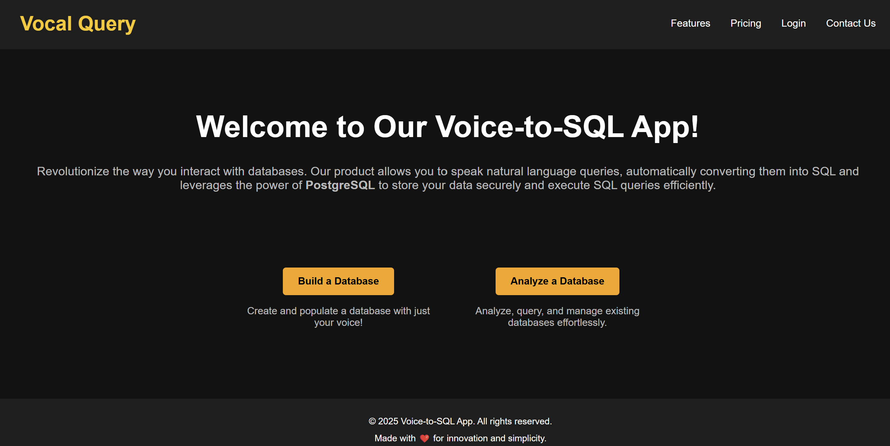
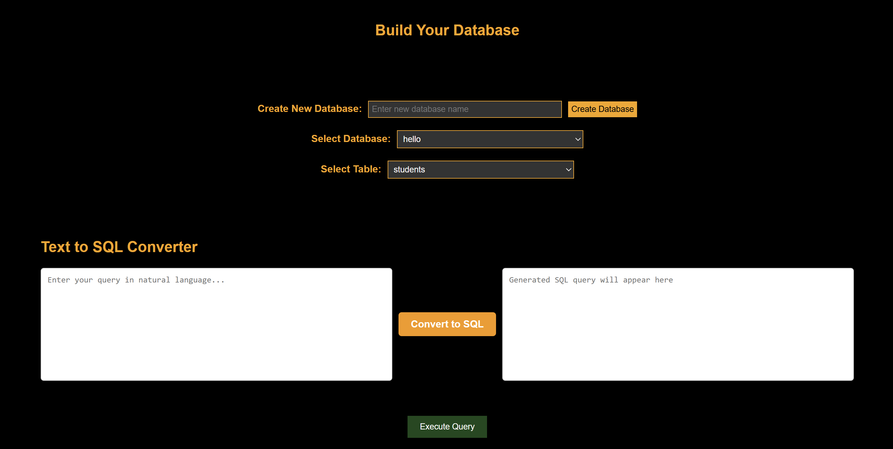

# 🏆 **AI-Powered Text-to-SQL Generator for PostgreSQL Databases**

  
*Transforming Natural Language into SQL Queries Instantly!*

---

## 🚀 **Overview**

Welcome to the **Text-to-SQL Query Generator**, a cutting-edge tool that transforms natural language into SQL queries effortlessly. Our product leverages the power of OpenAI's LLM (Large Language Model) to generate SQL queries based on your input. Not only can you generate queries, but you can also execute them directly on a PostgreSQL database. 

But that's not all! Our project goes beyond simple query generation. With the integration of **LangChain**, we enable advanced data analysis capabilities, allowing you to fetch and analyze data from tables with millions or even billions of rows and columns. Whether you're a data scientist, analyst, or developer, this tool is designed to make your life easier.

### **Key Highlights:**
✔️ Convert **simple text inputs** into SQL queries effortlessly.  
✔️ Execute queries instantly on **PostgreSQL databases**.  
✔️ Analyze and fetch data from **millions or even billions of rows**.  
✔️ **LangChain-powered** AI model for enhanced database interaction.  
✔️ Boosts efficiency by eliminating SQL query writing bottlenecks.  

---

## 📌 **Key Features**

### 🔹 **1. Instant SQL Query Generation**
- Simply describe the data operation you want, and the AI will generate a fully functional SQL query.
- Works with **SELECT, INSERT, UPDATE, DELETE, JOIN**, and other SQL commands.

### 🔹 **2. Real-Time Execution on PostgreSQL**
- Directly run the generated SQL queries on your connected **PostgreSQL** database.
- Fetch insights, modify tables, and analyze records seamlessly.

### 🔹 **3. Large-Scale Data Analysis with LangChain**
- Retrieve and process information from **millions or billions of rows**.
- AI-driven query optimization for efficient large-scale operations.

---

## ⚙️ **Project Setup**

### ✅ Step 1: Install Python 3.9 or Higher
Download and install Python from the official website:  
🔗 [Python Download](https://www.python.org/downloads/)

### ✅ Step 2: Install Dependencies
Run the following command to install all required dependencies:

```bash
pip install -r requirements.txt
```

### ✅ Step 3: Set OpenAI API Key in Environment
Add your OpenAI API key as an environment variable:

#### **Windows Command Prompt**
```cmd
set OPENAI_API_KEY=your_openai_api_key
```

#### **Windows PowerShell**
```powershell
$env:OPENAI_API_KEY="your_openai_api_key"
```

#### **Linux/Mac**
```bash
export OPENAI_API_KEY=your_openai_api_key
```

### ✅ Step 4: Add PostgreSQL Connection Details
In `app.py`, update the database configuration with your credentials:

```python
DATABASE = {
    "dbname": "your_dbname",
    "user": "your_username",
    "password": "your_password",
    "host": "localhost",
    "port": 5432
}
```

### ✅ Step 5: Run the Application
Start the AI-powered SQL generator:

```bash
python app.py
```

### ✅ Step 6: Ask Your Text Query
Once the application is running, simply type a question:

```plaintext
> How many models are there in the garage?
```

The AI will generate and execute the respective SQL query, fetching the results instantly!

---

## 🖼️ **Screenshots**

### **1️⃣ Text-to-SQL Dashboard page**
  
*Your Central Hub for all activities.*

### **2️⃣ Query Execution & Output**
  
*User input transformed into an SQL query and Execution of the generated SQL query in PostgreSQL.*

### **3️⃣ AI-Powered Data Analysis with LangChain**
  
*Retrieving and analyzing large datasets seamlessly.*

---


## 💡 **Why Use Text-to-SQL AI?**
✅ **No SQL Knowledge Required** – Convert plain text into queries.  
✅ **Instant Execution** – Run queries directly on PostgreSQL.  
✅ **Handles Large Datasets** – Analyze massive tables efficiently.  
✅ **AI-Driven Optimization** – LangChain enhances query accuracy.  

---

## 📩 **Contact & Support**
📧 Email: mamlesh.va06@gmail.com | nishyanthnandagopal@gmail.com
 

🔹 *Join us in revolutionizing database interactions with AI!* 🚀
