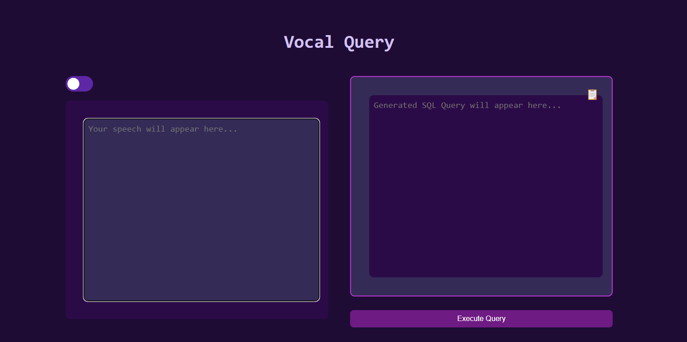
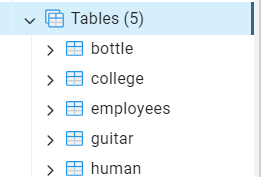

### VOCAL QUERY

This application provides an API for transcribing audio and converting spoken commands into SQL queries using Google APIs and a generative AI model. It first transcribes real time audio submitted by users via Google’s Speech-to-Text API. Then, using the transcribed text, it generates a SQL query in PostgreSQL syntax with the help of the Google Gemini AI model. The generated query is cleaned, executed in a PostgreSQL database. 

### How to run### How to Run

1. **Set Up Server**

   - Navigate to the server folder:
     ```bash
     cd server
     ```

   - Add your Google Speech-to-Text API credentials in the `Google-SpeechToText-API-Credentials.json` file.

   - Create a `.env` file in the server folder and add your Google Gemini API key:
     ```env
     GOOGLE_API_KEY=your_google_gemini_api_key
     ```

   - Update the PostgreSQL password in the code to match your database credentials.

   - Run the Flask app:
     ```bash
     python app.py
     ```

2. **Set Up Client**

   - Navigate to the client folder:
     ```bash
     cd client
     ```

   - Install dependencies:
     ```bash
     npm install
     ```

   - Start the client application:
     ```bash
     npm start
     ```

### Frontend



### Postgresql Table Creation/Automation



